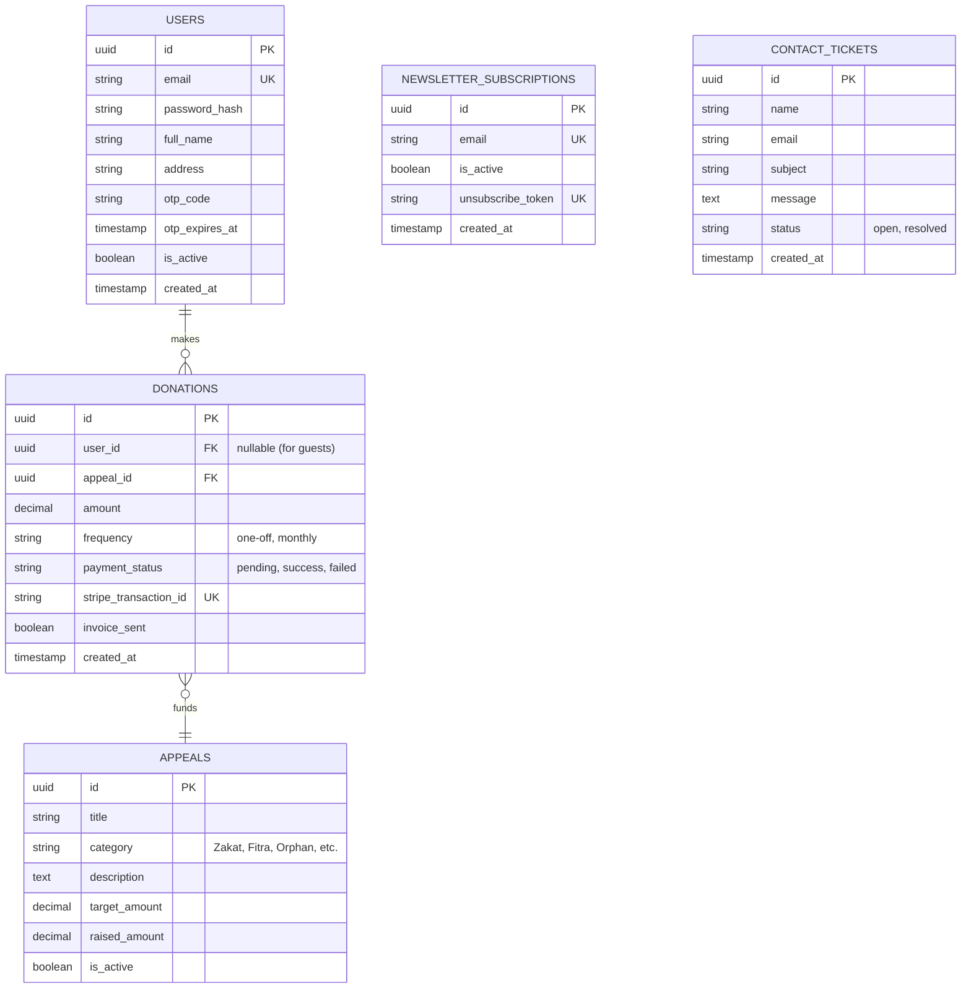

# BRDT Charity Website: Database Schema Planning

Based on the BRDT Data Flow Diagram and Application Requirements, the database is normalized into four core domains (D1-D4). This schema plan uses relational database standards (PostgreSQL/MySQL).

---

## Entity Relationship Diagram (ERD)

---

## Table Definitions

### Domain 1: Users (D1)
Handles all authentication, donor profiles, and OTP generation.

**Table: `users`**
| Column Name | Data Type | Constraints | Description |
| :--- | :--- | :--- | :--- |
| `id` | UUID | PRIMARY KEY | Unique user identifier. |
| `email` | VARCHAR(255) | UNIQUE, NOT NULL | User's login email. |
| `password_hash` | VARCHAR(255) | NOT NULL | Bcrypt hashed password. |
| `full_name` | VARCHAR(255) | NOT NULL | Donor's full name. |
| `address` | TEXT | NULLABLE | Physical billing address. |
| `otp_code` | VARCHAR(6) | NULLABLE | 6-digit OTP for password resets. |
| `otp_expires_at` | TIMESTAMP | NULLABLE | Expiration time for the OTP (e.g. 15 mins). |
| `is_active` | BOOLEAN | DEFAULT FALSE | True if email is verified. |
| `role` | VARCHAR(50) | DEFAULT 'donor' | 'donor' or 'admin'. |
| `created_at` | TIMESTAMP | DEFAULT NOW() | Record creation timestamp. |

---

### Domain 2: Donations (D2)
Handles payment intents, transaction logs, and invoice tracking.

**Table: `donations`**
| Column Name | Data Type | Constraints | Description |
| :--- | :--- | :--- | :--- |
| `id` | UUID | PRIMARY KEY | Unique donation record ID. |
| `user_id` | UUID | FOREIGN KEY | Links to `users.id` (Nullable for guests). |
| `appeal_id` | UUID | FOREIGN KEY | Links to `appeals.id`. |
| `amount` | DECIMAL(10,2) | NOT NULL | Amount donated. |
| `currency` | VARCHAR(3) | DEFAULT 'BDT' | Currency code (e.g. BDT, GBP). |
| `frequency` | VARCHAR(50) | NOT NULL | 'one-off' or 'monthly'. |
| `payment_status`| VARCHAR(50) | DEFAULT 'pending' | 'pending', 'success', 'failed'. |
| `stripe_txn_id` | VARCHAR(255) | UNIQUE | Stripe Payment Intent ID. |
| `invoice_sent` | BOOLEAN | DEFAULT FALSE | Tracks if the dual-email invoice fired. |
| `created_at` | TIMESTAMP | DEFAULT NOW() | Timestamp of donation. |

---

### Domain 3: Content & Appeals (D3)
Handles dynamic rendering for specific campaigns.

**Table: `appeals`**
| Column Name | Data Type | Constraints | Description |
| :--- | :--- | :--- | :--- |
| `id` | UUID | PRIMARY KEY | Unique appeal/project ID. |
| `title` | VARCHAR(255) | NOT NULL | E.g., "Ramadan Food Appeal". |
| `category` | VARCHAR(100) | NOT NULL | Zakat, Fitra, Orphan, Water, etc. |
| `description` | TEXT | NOT NULL | Details shown on the frontend. |
| `target_amount` | DECIMAL(10,2) | NULLABLE | Fundraising goal. |
| `raised_amount` | DECIMAL(10,2) | DEFAULT 0 | Real-time amount raised. |
| `is_active` | BOOLEAN | DEFAULT TRUE | Allows hiding completed appeals. |

---

### Domain 4: Communications (D4)
Handles contact form submissions and centralized newsletter lead capture.

**Table: `newsletter_subscriptions`**
| Column Name | Data Type | Constraints | Description |
| :--- | :--- | :--- | :--- |
| `id` | UUID | PRIMARY KEY | Unique subscription ID. |
| `email` | VARCHAR(255) | UNIQUE, NOT NULL | Centralized email lead. |
| `is_active` | BOOLEAN | DEFAULT TRUE | Allows users to unsubscribe. |
| `unsubscribe_token`| VARCHAR(255) | UNIQUE | Token for secure 1-click unsubscribe. |
| `created_at` | TIMESTAMP | DEFAULT NOW() | Date joined. |

**Table: `contact_tickets`**
| Column Name | Data Type | Constraints | Description |
| :--- | :--- | :--- | :--- |
| `id` | UUID | PRIMARY KEY | Unique ticket ID. |
| `name` | VARCHAR(255) | NOT NULL | Visitor's name. |
| `email` | VARCHAR(255) | NOT NULL | Visitor's email address. |
| `subject` | VARCHAR(255) | NOT NULL | Subject of the inquiry. |
| `message` | TEXT | NOT NULL | Body of the message. |
| `status` | VARCHAR(50) | DEFAULT 'open' | 'open', 'in_progress', 'resolved'. |
| `created_at` | TIMESTAMP | DEFAULT NOW() | Timestamp of inquiry. |

---

## Important Architectural Notes
1. **Guest Donations:** The `user_id` in the `donations` table is nullable. This ensures users do not *have* to register to complete a donation.
2. **OTP Security:** `otp_code` is stored directly on the user table to easily wipe it via an `otp_expires_at` check without requiring a separate table (keeps it lightweight).
3. **No Duplicate Emails:** The `email` column in `newsletter_subscriptions` has a `UNIQUE` constraint to prevent double-subscribing, fulfilling requirement F5.
4. **Invoice Tracking:** The `invoice_sent` boolean acts as a failsafe so the cron-job or webhook can retry if the Dual-Email system temporarily fails.
