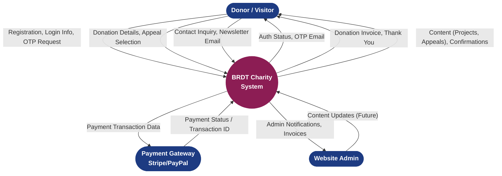
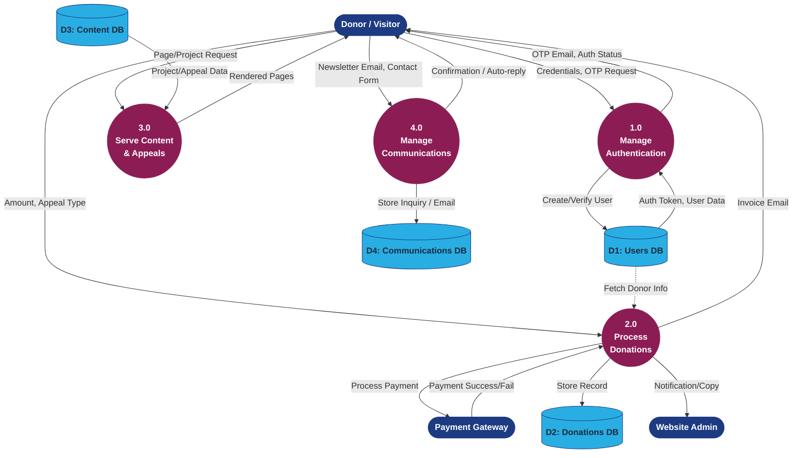

# BRDT Charity System: Data Flow Diagrams

As a Senior Database Engineer, I've designed the Data Flow Diagrams (DFD) for the BRDT Charity Website. These diagrams map out how data moves between the system, external entities (like donors and payment gateways), and our data stores. 

I've structured this into two levels: **Level 0 (Context Diagram)** which gives a high-level bird's-eye view, and **Level 1** which breaks down the core functional processes.

---

## Level 0: Context Diagram
This diagram shows the BRDT Charity System as a single high-level process interacting with external entities.

---

## Level 1: Core Processes DFD
This diagram breaks down the main system into four core sub-processes, detailing how they interact with specific database tables based on your requirement listing.

### Key Highlights from a Database & UI Perspective:
1. **Separation of Concerns**: The processes strictly handle specific domains (Auth, Donations, Content, Communications), which translates well to micro-services or modular MVC backend architectures in the future.
2. **Dual-Email System Handled**: Process `2.0` clearly forks the output flow for donations, sending the invoice to the Donor and the notification directly to the Admin.
3. **Centralized Subscriptions**: Process `4.0` funnels all newsletter emails directly into `D4: Communications DB`, ensuring no leads are lost across different pages.
4. **OTP Flow**: Process `1.0` accounts for the round-trip of sending the OTP email to the donor and verifying it against `D1`.
